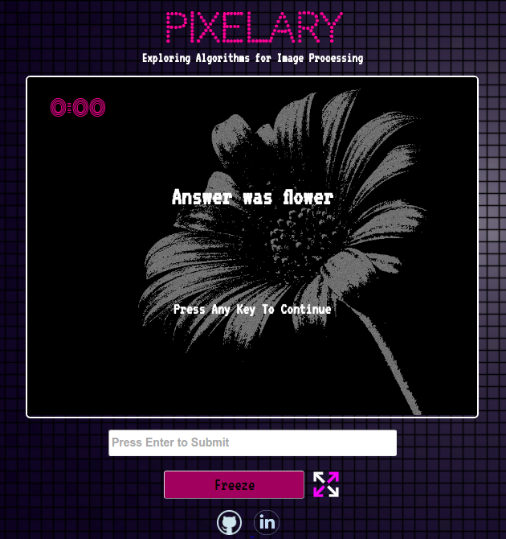

##Pixelary

[Live](https://nvizzutti.github.io/pixelary)

Pixelary is a demonstration of basic image processing algorithms with a guessing component like pictionary. Pictures are filtered via iteration through individual pixels, adjusting RGBA channels along the way.

###Vanilla JS

The scripts were written in Vanilla JavaScript, only using jQuery for manipulating text in the DOM. Writing functions that iterate through 480,000 pixels several times over demonstrates how small code changes can create massive differences or odd behavior when working on a macro level.

###Asynchronous Code

Timed components and recursive calls made for an interesting development environment. Running multiple asynchronous operational loops at the same time made it a challenge to keep all shared variables accessible and reflecting the current state of the application.

On load, `jQuery` listens for a `keypress` event, and checks if the application is currently running. If it is not, it clears the `#messages` div of text, resets the clock and calls for the image to be built. Selecting a random function from the `Filters` object, the function is called repeatedly.

###Filtering Algorithms

HTML5 stores `ImageData` not in an object, but in a massive array. The 1-dimensional array stores 4 values for each pixel, RGBA. So the array has a length of `width * height * 4`. Each pixel value is compared with its counterpart from the original, and depending on the filter it is adjusted accordingly. Some filters must convert all pixels to gray scale first, by calculating a pixel's luminosity between it's values, and mapping them to a common value on the gray scale.

There was some cool things that were discovered, including the patterns that emerge when you base a pixel's brightness based on it's distance from a point, and mapping only prime values onto the image.

###Complexity and Cost

Iterating through an array of 1,920,000 elements is not cheap, and doing it multiple times per second begins to make O(n) time unsustainable. Some of the limitations of vanilla JS made handling complexity difficult, especially in having an image change dynamically. A possible trade off would be to store the new target image data in a hash, and lookup the value instead of re-calculating it.

### Canvas Transformation

To allow users to take a closer look at what is happening pixel by pixel if they so choose, I implemented a zoom feature where they can hover over an icon and view the canvas at 400% as it is being rendered. The canvas itself is being re-rendered constantly, so I utilized CSS instead of HTML5's transform method. The canvas remains in its container and is able to continue its process, while simultaneously a class is added which adjusts the CSS `zoom` property to allow for closer inspection.

###Future Directions

- [ ] Optimize filter operations and call stack
- [ ] Have optional display of visualizations and explanations
- [ ] Increase interactivity by having user select algorithms
- [ ] Complete more complicated algorithms including convolving images.
