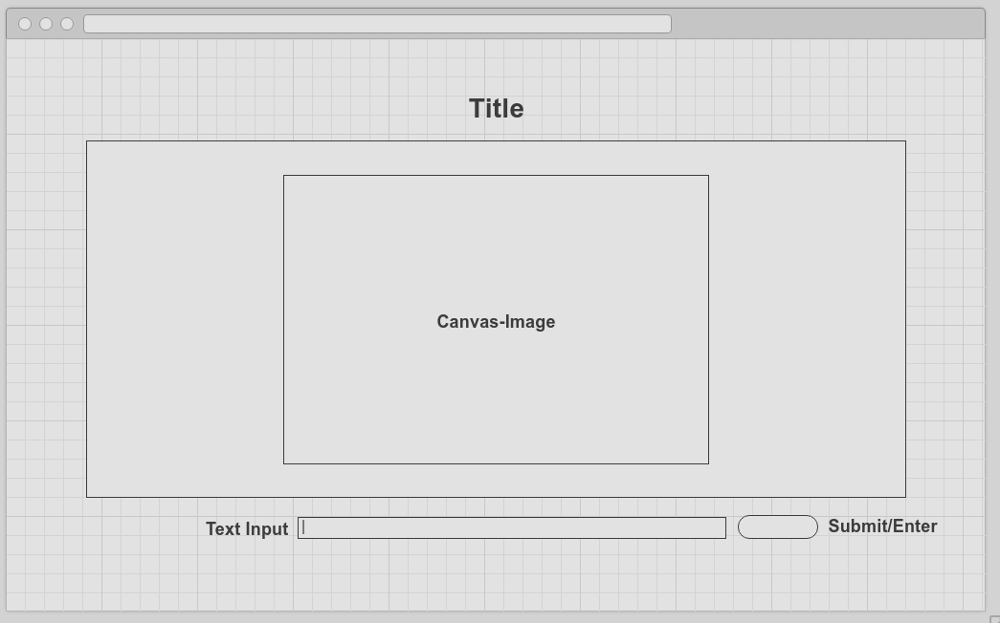

## Pixelary

Pictionary is a game that nearly everyone knows, but probably hasn't played against a computer with pixels. Using the DOM and HTML5 Canvas, The script will rebuild a random image from a collection, and have the user guess the subject. The difficulty can increase as the program increasingly makes changes to the original image, or builds it out of order.

### List for MVP

- [ ] Start a game, reset.
- [ ] A Countdown Timer.
- [ ] User guesses, with guess number being stored.
- [ ] Have levels of difficulty increase as the game continues.
- [ ] Production README

I plan to include with time:
- [ ] User options available to alter image manipulation and do some fun things

### Wireframe

  The game will be centered in the window, with the Canvas not taking up the entire window both due to leaving area for input as well as preserving processing power since the application will be performing many iterations. The user will interact with primarily with the keyboard, typing input in and either clicking the button or more simply pressing Enter. Instructions will be minimal and displayed before the user begins.

### Project Architecture

This project will be primarily implemented using Vanilla JavaScript and HTML5 Canvas to manipulate the DOM. Easel.js will also be used with containers to separate the sections of the canvas, and allow the image to be rendered in a section of the canvas. Webpack will serve the script to the HTML page in a single file.

-`image.js` Will handle the loading/rendering and manipulation of image pixels, mostly through adjustment of RGBA data.
-`dashboard.js` Will handle the other game data such as the timer, and receiving and handling input from the guessing field.
`settings.js` Will adjust the way images are recreated and difficulty through color randomization or other quirks.

### Implementation Timeline

**Day 1**- Get project directory built with `webpack.config.js` and `package.json`. Have the project repo up and running with a basic Canvas element. Learn about Canvas' pixel manipulation and get Canvas to pull image data and successfully rebuild image. Have basic files for each script.

**Day 2**- Be able to manipulate images over a period of time. Work on making the process look smooth and timely. Extend code so that it will complete the process differently with increasing difficulty, using increased randomization.

**Day 3**- Make input field active if not already, and make string comparison to image content. Build the rest of the dashboard and create game timer. Make sure the game has all the controls to start and stop intuitively, and that the game ends when the rebuilding process is done, or the parsed input is correct.

**Day 4**- Work on CSS and make sure it looks clean, and the animation is clean. Add to the settings to allow users to adjust how the image is manipulated. Have some cool options that look pretty. Make sure production Readme is done and engaging.

### Bonuses

  If the MVPs are completed earlier than expected, there are a few ways to improve the project:

- [ ] Have mixed images, where users guess two words instead of one.
- [ ] Give the images some effects from easel.js, such as perspective, blur, etc.

####Note To a/A:
I'm was having a hard time gauging the difficulty of these projects because most of the ideas work with libraries I haven't spent much time with. Please let me know if I am off-base, as I do not want to do something overly simple. I will remove this from README.
